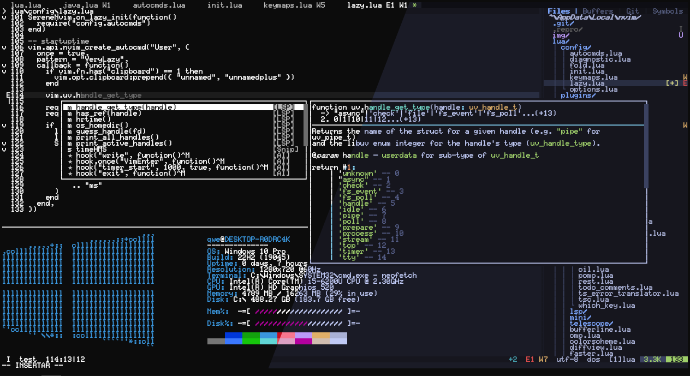

<div align="center">

# TM10YMhp's init.lua

Arranque rapido, bajo consumo de memoria, y carga diferida gracias a [💤 lazy.nvim](https://github.com/folke/lazy.nvim).

Elija el fragmento de código que comprenda totalmente.

Siempre en WIP 🏗



<sub>Para conocer el esquema de colores, consulte [serene.nvim](https://github.com/TM10YMhp/serene.nvim). Para ver más presentaciones, consulte la sección [presentaciones].</sub>

</div>

## 💡 ¿Encontraste un problema o tienes una sugerencia?

Si encuentra algun problema o tiene alguna sugerencia, por favor abre un issue y estare encantado de discutirlo contigo.

## ✨ Caracteristicas

- 🚀 Increiblemente rapido.
- 💤 VeryLazy, complementos cargados muy perezosamente gracias a [lazy.nvim](https://github.com/folke/lazy.nvim).
- 📦 Más de 100 complementos preconfigurados y listos para usar.

## ⚡️ Requisitos previos

- neovim >= 0.10.0 (debe construirse con LuaJIT)
- git >= 2.19.0 (para soporte de clones parciales)
- node >= 20.10.0
- curl >= 8.4.0
- un compilador **C** para `nvim-treesitter`. Mira [aquí](https://github.com/nvim-treesitter/nvim-treesitter#requirements)
- para `telescope.nvim`
  - [ripgrep](https://github.com/BurntSushi/ripgrep) >= 13.0.0
  - [make]() para `telescope-fzf-native.nvim`. Mira [aqui]()
- para `rest.nvim` **(opcional)**
  - [jq](https://github.com/jqlang/jq)
  - [tidy](https://github.com/htacg/tidy-html5)

## 🚀 Empezando

### 1. Descargar configuracion

- Eliminar archivos de Neovim actuales

```bash
# linux/macos (unix)
rm -rf ~/.config/nvim
rm -rf ~/.local/share/nvim
rm -rf ~/.local/state/nvim/
rm -rf ~/.cache/nvim

# windows
rd -r ~\AppData\Local\nvim
rd -r ~\AppData\Local\nvim-data
```

- Posicionarse en el directorio

```bash
# linux/macos (unix)
cd ~/.config/

# windows
cd ~/AppData/Local/
```

- Clonar repositorio

```
git clone -b test https://github.com/TM10YMhp/init.lua.git nvim
```

- Elimina la carpeta `.git` para que puedas agregarla a tu propio repositorio más tarde

```
rm -rf .git/
```

- ¡Inicie Neovim!

```
nvim
```

### 2. Instalar complementos

Luego de iniciar neovim espere a que `lazy.nvim` instale todos los complementos y finalmente reinicie neovim.
